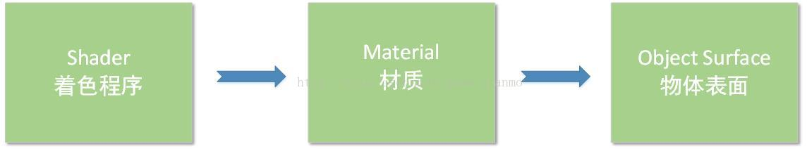
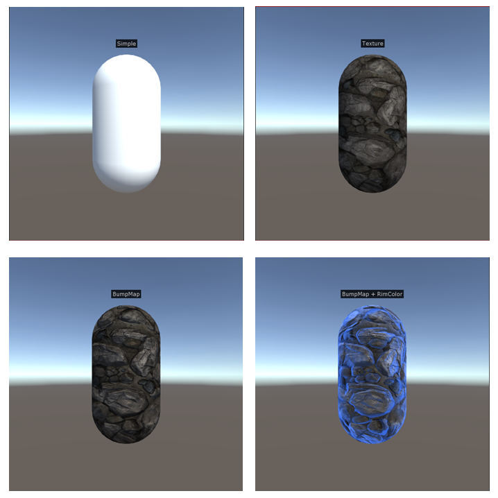

# Lesson 1 游戏场景的创建 & 第一个Shader的书写

> Ref: 浅墨的[《Unity Shader编程》](https://blog.csdn.net/column/details/unity3d-shader.html)专栏
>
> Ref: [【浅墨Unity3D Shader编程】之一 夏威夷篇：游戏场景的创建 & 第一个Shader的书写](http://blog.csdn.net/poem_qianmo/article/details/40723789)
>
> Ref: https://docs.unity3d.com/Manual/SL-SurfaceShaderExamples.html
>
> Ref: [Shader Reference](https://docs.unity3d.com/Manual/SL-Reference.html)
>
> Ref: [ShaderLab Syntax](https://docs.unity3d.com/Manual/SL-Shader.html)

Date: 2018.4.14~2018.4.15

[TOC]

**首先，我为什么要学习写Shader？**

GPU管道中最有趣的部分，可编程着色器。有什么理由不去学习呢？不是说要做出很多牛逼的特效，而是通过实作，去学习计算机图形学，去更加了解其中光照，材质，纹理，更加了解渲染原理，作为日后做游戏的内功。既然开始了，就好好的做好吧！加油！

## 书写第一个Shader
**凹凸纹理显示+自选边缘颜色和强度Shader**
```c++
Shader "RogerXu/0.TheFirstShader"
{
	// 属性
	// Ref: https://docs.unity3d.com/Manual/SL-Properties.html
	Properties 
    {
		_MainTex("Texture", 2D) = "white" {}
		_BumpMap("Bump Map", 2D) = "bump" {}
		_RimColor("Rim Color", Color) = (0.17, 0.36, 0.81, 0.0)
		_RimPower("Rim Power", Range(0.6, 9.0)) = 1.0
	}

	// 开始一个子着色器
	SubShader {
		Tags { "RenderType" = "Opaque" }

		// 开始CG着色器编程语言段
		CGPROGRAM

		// 使用内置的兰伯特光照模型
		#pragma surface surf Lambert

		// 输入结构
		struct Input 
        {
            float2 uv_MainTex;
            float2 uv_BumpMap;
            float3 viewDir;
		};

		// 变量声明
		// Accessing shader properties in Cg/HLSL
		// 即为了使Cg程序获得 属性块 中的属性，需要进行如下的变量声明。详细介绍参考如下链接
		// Ref: https://docs.unity3d.com/Manual/SL-PropertiesInPrograms.html
		sampler2D _MainTex;
		sampler2D _BumpMap;
		float4 _RimColor;
		float _RimPower;

		// 表面着色器
		void surf(Input IN, inout SurfaceOutput o)
		{
			// 设置漫反射颜色
			o.Albedo = tex2D(_MainTex, IN.uv_MainTex).rgb;
			// 表面法线为凹凸纹理的颜色
			o.Normal = UnpackNormal(tex2D(_BumpMap, IN.uv_BumpMap));
			// 边缘颜色强度
			half rim = 1.0 - saturate(dot(normalize(IN.viewDir), o.Normal));
			// 边缘颜色
			o.Emission = _RimColor.rgb * pow(rim, _RimPower);
		}

		// 结束CG着色器编程语言段
		ENDCG
	}

	// 撤退版本，普通漫反射
	Fallback "Diffuse"
}
```

需要注意的是，Shader想要使用到游戏物体上，一般得有个媒介，这个媒介就是我们的老朋友――材质（Material）。我们把Shader作用于材质，接着再把材质对应地作用于给游戏物体，这样写的Shader就间接地给物体表面使用了。



**拓展，Materials, Shaders & Textures**

> Ref: https://docs.unity3d.com/Manual/Shaders.html

- **Materials** define how a surface should be rendered, by including references to the Textures it uses, tiling information, Color tints and more. The available options for a Material depend on which Shader the Material is using.
- **Shaders** are small scripts that contain the mathematical calculations and algorithms for calculating the Color of each pixel rendered, based on the lighting input and the Material configuration.
- **Textures** are bitmap images. A Material can contain references to textures, so that the Material’s Shader can use the textures while calculating the surface color of a GameObject. In addition to basic Color (Albedo) of a GameObject’s surface, Textures can represent many other aspects of a Material’s surface such as its reflectivity or roughness.


## 功能脚本：添加文字说明

```c#

//-----------------------------------------------【脚本说明】-------------------------------------------------------
//      脚本功能：    在场景中和游戏窗口中分别显示给任意物体附加的文字标签信息
//      使用语言：   C#
//      开发所用IDE版本：Unity4.5 06f 、Visual Studio 2010    
//      2014年10月 Created by 浅墨    
//      更多内容或交流，请访问浅墨的博客：http://blog.csdn.net/poem_qianmo
//---------------------------------------------------------------------------------------------------------------------

//-----------------------------------------------【使用方法】-------------------------------------------------------
//      第一步：在Unity中拖拽此脚本到某物体之上，或在Inspector中[Add Component]->[浅墨's Toolkit v1.0]->[ShowObjectInfo]
//      第二步：在Inspector里,Show Object Info 栏中的TargetCamera参数中选择需面向的摄像机,如MainCamera
//      第三步：在text参数里填需要显示输出的文字。
//      第四步：完成。运行游戏或在场景编辑器Scene中查看显示效果。

//      PS：默认情况下文本信息仅在游戏运行时显示。
//      若需要在场景编辑时在Scene中显示，请勾选Show Object Info 栏中的[Show Info In Scene Editor]参数。
//      同理,勾选[Show Info In Game Play]参数也可以控制是否在游戏运行时显示文本信息
//---------------------------------------------------------------------------------------------------------------------


//预编译指令，检测到UNITY_EDITOR的定义，则编译后续代码
#if UNITY_EDITOR    


//------------------------------------------【命名空间包含部分】----------------------------------------------------
//  说明：命名空间包含
//----------------------------------------------------------------------------------------------------------------------
using UnityEngine;
using UnityEditor;
using System.Collections;

//添加组件菜单
[AddComponentMenu("浅墨's Toolkit v1.0/ShowObjectInfo")]

//开始ShowObjectInfo类
public class ShowObjectInfo : MonoBehaviour
{
    //------------------------------------------【变量声明部分】----------------------------------------------------
    //  说明：变量声明部分
    //------------------------------------------------------------------------------------------------------------------
    public string text="键入你自己的内容 by浅墨";//文本内容
    public Camera TargetCamera;//面对的摄像机
    public bool ShowInfoInGamePlay = true;//是否在游戏运行时显示此信息框的标识符
    public bool ShowInfoInSceneEditor = false;//是否在场景编辑时显示此信息框的标识符
    private static GUIStyle style;//GUI风格
    
    //------------------------------------------【GUI 风格的设置】--------------------------------------------------
    //  说明：设定GUI风格
    //------------------------------------------------------------------------------------------------------------------
    private static GUIStyle Style
    {
        get
        {
            if (style == null)
            {
                //新建一个largeLabel的GUI风格
                style = new GUIStyle(EditorStyles.largeLabel);
                //设置文本居中对齐
                style.alignment = TextAnchor.MiddleCenter;
                //设置GUI的文本颜色
                style.normal.textColor = new Color(0.9f, 0.9f, 0.9f);
                //设置GUI的文本字体大小
                style.fontSize = 26;
            }
            return style;
        }
    }

    //-----------------------------------------【OnGUI()函数】-----------------------------------------------------
    // 说明：游戏运行时GUI的显示
    //------------------------------------------------------------------------------------------------------------------
    void OnGUI( )
    {
        //ShowInfoInGamePlay为真时，才进行绘制
        if (ShowInfoInGamePlay)
        {
            //---------------------------------【1.光线投射判断&计算位置坐标】-------------------------------
            //定义一条射线，从 capsule 上方（应该摄像机的上方方向一致），向下发射射线，取得交点
            Ray ray = new Ray(transform.position + TargetCamera.transform.up * 6f, -TargetCamera.transform.up);
            //定义光线投射碰撞
            RaycastHit raycastHit;
            //进行光线投射操作,第一个参数为光线的开始点和方向，第二个参数为光线碰撞器碰到哪里的输出信息，第三个参数为光线的长度
            GetComponent<Collider>().Raycast(ray, out raycastHit, Mathf.Infinity);
            //计算距离，为当前摄像机位置减去碰撞位置的长度
            float distance = (TargetCamera.transform.position - raycastHit.point).magnitude;
            //设置字体大小，在26到12之间插值
            float fontSize = Mathf.Lerp(26, 12, distance / 10f);
            //将得到的字体大小赋给Style.fontSize
            Style.fontSize = (int)fontSize;
            //将文字位置取为得到的光线碰撞位置上方一点
            Vector3 worldPositon = raycastHit.point + TargetCamera.transform.up * distance * 0.04f;
            //世界坐标转屏幕坐标
            Vector3 screenPosition = TargetCamera.WorldToScreenPoint(worldPositon);
            //z坐标值的判断，z值小于零就返回
            if (screenPosition.z <= 0){return;}
            //翻转Y坐标值
            screenPosition.y = Screen.height - screenPosition.y;
            
            //获取文本尺寸
            Vector2 stringSize = Style.CalcSize(new GUIContent(text));
            //计算文本框坐标
            Rect rect = new Rect(0f, 0f, stringSize.x + 6, stringSize.y + 4);
            //设定文本框中心坐标
            rect.center = screenPosition - Vector3.up * rect.height * 0.5f;


            //----------------------------------【2.GUI绘制】---------------------------------------------
            //开始绘制一个简单的文本框
            Handles.BeginGUI();
            //绘制灰底背景
            GUI.color = new Color(0f, 0f, 0f, 0.8f);
            GUI.DrawTexture(rect, EditorGUIUtility.whiteTexture);
            //绘制文字
            GUI.color = new Color(1, 1, 1, 0.8f);
            GUI.Label(rect, text, Style);
            //结束绘制
            Handles.EndGUI();
        }
    }

    //-------------------------------------【OnDrawGizmos()函数】---------------------------------------------
    // 说明：场景编辑器中GUI的显示
    //------------------------------------------------------------------------------------------------------------------
    void OnDrawGizmos()
    {
        //ShowInfoInSeneEditor为真时，才进行绘制
        if (ShowInfoInSceneEditor)
        {
            //----------------------------------------【1.光线投射判断&计算位置坐标】----------------------------------
            //定义一条射线
            Ray ray = new Ray(transform.position + Camera.current.transform.up * 6f, -Camera.current.transform.up);
            //定义光线投射碰撞
            RaycastHit raycastHit;
            //进行光线投射操作,第一个参数为光线的开始点和方向，第二个参数为光线碰撞器碰到哪里的输出信息，第三个参数为光线的长度
            GetComponent<Collider>().Raycast(ray, out raycastHit, Mathf.Infinity);
            
            //计算距离，为当前摄像机位置减去碰撞位置的长度
            float distance = (Camera.current.transform.position - raycastHit.point).magnitude;
            //设置字体大小，在26到12之间插值
            float fontSize = Mathf.Lerp(26, 12, distance / 10f);
            //将得到的字体大小赋给Style.fontSize
            Style.fontSize = (int)fontSize;
            //将文字位置取为得到的光线碰撞位置上方一点
            Vector3 worldPositon = raycastHit.point + Camera.current.transform.up * distance * 0.1f;
            //世界坐标转屏幕坐标
            Vector3 screenPosition = Camera.current.WorldToScreenPoint(worldPositon);
            //z坐标值的判断，z值小于零就返回
            if (screenPosition.z <= 0) { return; }
            //翻转Y坐标值
            screenPosition.y = Screen.height - screenPosition.y;
            
            //获取文本尺寸
            Vector2 stringSize = Style.CalcSize(new GUIContent(text));
            //计算文本框坐标
            Rect rect = new Rect(0f, 0f, stringSize.x + 6, stringSize.y + 4);
            //设定文本框中心坐标
            rect.center = screenPosition - Vector3.up * rect.height * 0.5f;
            
            //----------------------------------【2.GUI绘制】---------------------------------------------
            //开始绘制一个简单的文本框
            Handles.BeginGUI();
            //绘制灰底背景
            GUI.color = new Color(0f, 0f, 0f, 0.8f);
            GUI.DrawTexture(rect, EditorGUIUtility.whiteTexture);
            //绘制文字
            GUI.color = new Color(1, 1, 1, 0.8f);
            GUI.Label(rect, text, Style);
            //结束绘制
            Handles.EndGUI();
        }
    }
}

//预编译命令结束
#endif

```

## 最终效果展示



加上了[法线贴图](https://en.wikipedia.org/wiki/Normal_mapping)和边缘颜色之后，模型的立体感（视觉效果）更好了。要注意的是，模型还是原来的胶囊体。可见贴图的强大呀。

## 总结

好的，第一课学习完毕，感受到着色器的强大功能（冰山一角）。仿写了一个 `凹凸纹理显示+自选边缘颜色和强度Shader` ，效果还是不错的呀。

