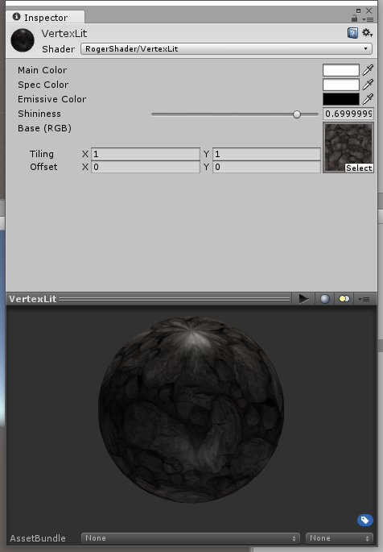
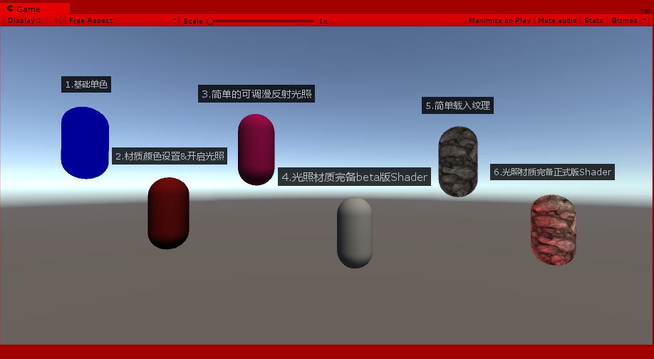

# Lesson 2 Unity3D的基本Shader框架写法&颜色、光照、与材质 

> Ref: 浅墨的[《Unity Shader编程》](https://blog.csdn.net/column/details/unity3d-shader.html)专栏
>

Date: 2018.4.15~4.16

[TOC]


## 1. 两种渲染管线与三种Shader类型

> Ref: https://docs.unity3d.com/Manual/SL-Reference.html

计算机图形学的中渲染管线一般可以分为两种类型：

1. 固定功能管线（Fixed-Function Pipeline）
2. 可编程管线（Programmable Pipeline）

Unity3D中，Shader可以分为三种基本类型：

1. 固定功能着色器（Fixed Function Shader）
2. 表面着色器（Surface Shader）
3. 顶点着色器&片段着色器（Vertex and Fragment Shader）


## 2. Unity3D的基本Shader框架

> [ShaderLab Syntax](https://docs.unity3d.com/Manual/SL-Shader.html)

```c++
Shader "name" { [Properties] Subshaders [Fallback] [CustomEditor] }
```
### 2.1 框架


```c++
Shader "RogerShader/0.Shader框架实例"
{
	Properties 
	{
		_MainTex("Texture",2D) = "red"{}
	}
	
	SubShader 
	{
		Pass
		{
			SetTexture[_MainTex]{Combine texture}
		}
	}

	Fallback "Diffuse"
}
```

### 2.2 Properties

Shaders can define a list of parameters to be set by artists in Unity’s [material inspector](https://docs.unity3d.com/Manual/Materials.html). The Properties block in the [shader file](https://docs.unity3d.com/Manual/SL-Shader.html) defines them.

```c++
Properties { Property [Property ...] }
```

1. Numbers and Sliders

   ```
   name ("display name", Range (min, max)) = number
   name ("display name", Float) = number
   name ("display name", Int) = number
   ```

2. Colors and Vectors

   ```
   name ("display name", Color) = (number,number,number,number)
   name ("display name", Vector) = (number,number,number,number)
   ```

3. Textures

   ```
   name ("display name", 2D) = "defaulttexture" {}
   name ("display name", Cube) = "defaulttexture" {}
   name ("display name", 3D) = "defaulttexture" {}
   ```

Example

```
// properties for a water shader
Properties
{
	_WaveScale("Wave scale", Range(0.02,0.15)) = 0.07 // sliders
	_ReflDistort("Reflection distort", Range(0,1.5)) = 0.5
	_RefrDistort("Refraction distort", Range(0,1.5)) = 0.4
	_RefrColor("Refraction color", Color) = (.34, .85, .92, 1) // color
	_ReflectionTex("Environment Reflection", 2D) = "" {} // textures
	_RefractionTex("Environment Refraction", 2D) = "" {}
	_Fresnel("Fresnel (A) ", 2D) = "" {}
	_BumpMap("Bumpmap (RGB) ", 2D) = "" {}
}
```

### 2.3 SubShader和Fallback

Each shader is comprised of a list of [sub-shaders](https://docs.unity3d.com/Manual/SL-SubShader.html). You must have at least one. When loading a shader, Unity will go through the list of subshaders, and pick the first one that is supported by the end user’s machine. If no subshaders are supported, Unity will try to use [fallback shader](https://docs.unity3d.com/Manual/SL-Fallback.html).

## 3. 光照、材质和颜色相关内容讲解（固定渲染管线）

> [ShaderLab: Legacy Lighting](https://docs.unity3d.com/Manual/SL-Material.html)

灯光和材质参数常常被用来控制内置的顶点光照。而Unity中的顶点光照也就是Direct3D/OpenGL标准的按每顶点计算的光照模型―― 光照打开时，光照受到 `Material block`, `ColorMaterial`和`SeparateSepcular`命令的影响。

**举个固定渲染管线的Shader栗子**

> Ref: https://docs.unity3d.com/Manual/ShaderTut1.html
>
> 


```c++
/*
This shader uses fixed-function pipeline to do standard per-vertex lighting.
Ref: https://docs.unity3d.com/Manual/ShaderTut1.html
*/

Shader "RogerShader/VertexLit"
{
	Properties
	{
		_Color("Main Color", Color) = (1,1,1,0.5)
		_SpecColor("Spec Color", Color) = (1,1,1,1)
		_Emission("Emissive Color", Color) = (0,0,0,0)
		_Shininess("Shininess", Range(0.01, 1)) = 0.7
		_MainTex("Base (RGB)", 2D) = "white"{}
	}

	SubShader
	{
		Pass
		{
			// a Material block that binds our property values to the fixed function lighting material settings.
			Material
			{
				Diffuse[_Color]
				Ambient[_Color]
				Shininess[_Shininess]
				Specular[_SpecColor]
				Emission[_Emission]
			}
			// turns on the standard vertex lighting
			Lighting On
			// enables the use of a separate color for the specular highlight
			SeparateSpecular On
			// define the textures we want to use and how to mix, combine and apply them in our rendering
			SetTexture[_MainTex]
			{
				constantColor[_Color]
				// Combine ColorPart, AlphaPart
				Combine texture * primary DOUBLE, texture * constant
			}
		}
	}

	Fallback "Diffuse"
}
```


### 3.1 用于 _Pass_ 中的代码写法列举

这些代码一般是写在Pass{}中的，细节如下：

**Color _Color_**<br>
设定对象为纯色。**颜色既可以是括号中的四值（RGBA），也可以是被方框包围的颜色属性名。**

**Material {_Material Block_}**<br>
材质块绑定 properties 中的值到光照材质中。

**Lighting _On_/_Off_**<br>
开启标准顶点光照。也就是确定材质块中的设定是否有效。如果想要有效的话必须使用Lighting On命令开启光照。注：如果打开光照，但未设置Material，则对象被渲染为黑色（即便设置了Color）。如果未打开光照，但设置了Material，则对象被渲染为白色。

**SeparateSpecular _On_/_Off_**<br>
开启独立镜面反射。这个命令会添加高光光照到着色器 _Pass_ 的末尾，使得贴图对高光没有影响。只有在光照开启时有效。

**ColorMaterial _AmbientAndDiffuse_/_Emission_**<br>
使用每顶点颜色替代材质中的颜色集。AmbientAndDiffuse替代材质的阴影光和漫反射值；Emission替代材质中的光发射值。

### 3.2 Material Block中相关代码写法举例 

下面这些代码的使用地方是在SubShader中的一个Pass{}中新开一个**Material{}块**，在这个Material{}块中进行这些语句的书写。如[Unity Manual](https://docs.unity3d.com/Manual/ShaderTut1.html)所说，Material Block binds our property values to the fixed function lighting material settings.

**Diffuse _Color_**<br>
漫反射颜色构成。这是对象的基本颜色。

**Ambient _Color_**<br>
环境色颜色构成。这是当对象被RenderingSettrings中设定的环境色所照射时所表现的颜色。

**Specular _Color_**<br>
高光颜色。

**Shininess _Number_**<br>
光泽度（控制高光），在0和1之间。0的时候你会发现更大的高亮也看起来像漫反射光照，1的时候你会获得一个细微的亮斑。

**最终，打在对象上的完整光照颜色为：**

`FinalColor = Ambient * Lighting Window's Ambient Intensity setting + (Light Color * Diffuse + Light Color * Specular) + Emission`

注意：方程式的灯光部分（也就是带括号的部分）对所有打在对象上的光线都是重复使用的。而我们在写Shader的时候**常常会将漫反射和环境光光保持一致**（所有内置Unity着色器都是如此）。

## 4. Shader书写实战

**最效果图终**



### 4.1 基础单色

```c
Shader "RogerShader/1.基础单色" 
{
	SubShader 
	{
		Pass
		{
			Color(0, 0, 0.6, 0)
		}
	}
	FallBack "Diffuse"
}
```

### 4.2 材质颜色设置&开启光照

```c++
Shader "RogerShader/2.材质颜色设置&开启光照" {
	Properties 
	{
		_Color("Main Color", Color) = (0.9, 0.5, 0.4, 1)
	}
	SubShader 
	{
		Pass
		{
			Material
			{
				Diffuse[_Color]
				Ambient[_Color]
			}
			Lighting On
		}
	}
	FallBack "Diffuse"
}
```

### 4.3 简单的可调漫反射光照

```c++
Shader "RogerShader/3.简单的可调漫反射光照" {
	Properties 
	{
		_MainColor("Main Color", Color) = (1, 0.1, 0.5, 1)
	}
	SubShader 
	{
		Pass
		{
			Material
			{
				Diffuse[_MainColor]
				Ambient[_MainColor]
			}
			Lighting On
		}
	}
	FallBack "Diffuse"
}
```

### 4.4 光照材质完备beta版Shader

```c++
Shader "RogerShader/4.光照材质完备beta版Shader" {
	Properties 
	{
		_Color ("Main Color", Color) = (1,1,1,1)
		_SpecColor ("Specular Color", Color) = (1,1,1,1)
		_Emission("Emissive Color", Color) = (0,0,0,0)
		_Shininess("Shininess", Range(0.01,1)) = 0.7
	}
	SubShader 
	{
		Pass
		{
			Material
			{
				Diffuse[_Color]
				Ambient[_Color]
				Shininess[_Shininess]
				Specular[_SpecColor]
				Emission[_Emission]
			}
			Lighting On
		}
	}
	FallBack "Diffuse"
}
```

### 4.5 简单载入纹理

```
Shader "RogerShader/5.简单载入纹理" {
	Properties 
	{
		_MainTex ("Texture", 2D) = "white" {}
	}
	SubShader 
	{
		Pass
		{
			SetTexture[_MainTex]
			{
				Combine texture
			}
		}
	}
	FallBack "Diffuse"
}
```

### 4.6 光照材质完备正式版Shader

```c++
Shader "RogerShader/6.光照材质完备正式版Shader" {
	Properties 
	{
		_Color ("Main Color", Color) = (1,1,1,1)
		_SpecColor ("Specular Color", Color) = (1,1,1,1)
		_Emission ("Emissive Color", Color) = (0,0,0,0)
		_Shininess ("Shininess", Range(0.01, 1)) = 0.7
		_MainTex ("Texture", 2D) = "white" {}
		
	}
	SubShader 
	{
		Pass
		{
			Material
			{
				Diffuse[_Color]
				Ambient[_Color]
				Specular[_SpecColor]
				Emission[_Emission]
				Shininess[_Shininess]
			}
			Lighting On
			SeparateSpecular On
			SetTexture[_MainTex]
			{
				Combine texture * primary DOUBLE, texture * primary
			}
		}
	}
	FallBack "Diffuse"
}
```

## 5. 总结

这一节，我学习了Unity3D的基本Shader框架，以及固定管线着色器的写法，最后，从简单到复杂，写出了集合了材质、光照（包括环境光、散射光、高光、自发光）、纹理贴图的固定管线着色器。

问题：如何在固定管线着色器中应用BumpMap，实现向Lesson 1中的那种凹凸纹理效果？


