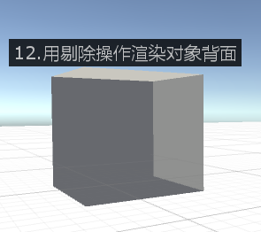
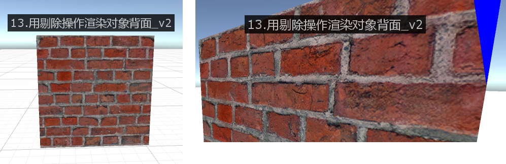
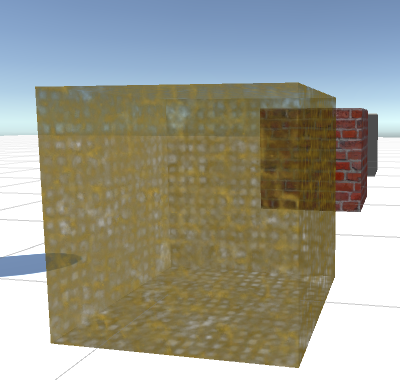
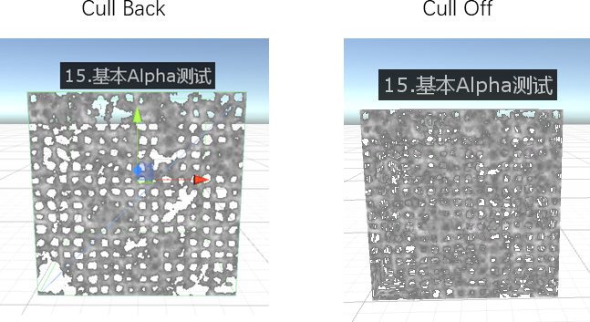
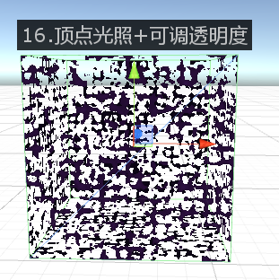

# Lesson 4 剔除、深度测试、Alpha测试以及基本雾效果

> Ref: 浅墨的[《Unity Shader编程》](https://blog.csdn.net/column/details/unity3d-shader.html)专栏

Date: 2018.4.29

[TOC]

## 1. 剔除和深度测试（Culling & Depth Testing）

> Ref: https://docs.unity3d.com/Manual/SL-CullAndDepth.html


### 1.1 概念

**Culling** is an optimization that does not render polygons facing away from the viewer. All polygons have a front and a back side. Culling makes use of the fact that most objects are closed; if you have a cube, you will never see the sides facing away from you (there is always a side facing you in front of it) so we don’t need to draw the sides facing away. Hence the term: Backface culling.

The other feature that makes rendering looks correct is **Depth testing**. Depth testing makes sure that only the closest surfaces objects are drawn in a scene.

### 1.2 语法

**Cull**

`Cull Back | Front | Off`

Controls which sides of polygons should be culled (not drawn)

**ZWrite**

`ZWrite On | Off`

Controls whether pixels from this object are written to the depth buffer (default is *On*). If you’re drawng solid objects, leave this on. If you’re drawing semitransparent effects, switch to `ZWrite Off`. For more details read below.

**ZTest**

`ZTest Less | Greater | LEqual | GEqual | Equal | NotEqual | Always`

How should depth testing be performed. Default is *LEqual* (draw objects in from or at the distance as existing objects; hide objects behind them).

**Offset**

`Offset Factor, Units`

Allows you specify a depth offset with two parameters. *factor* and *units*. *Factor* scales the maximum Z slope, with respect to X or Y of the polygon, and *units* scale the minimum resolvable depth buffer value. This allows you to force one polygon to be drawn on top of another although they are actually in the same position. For example `Offset 0, -1` pulls the polygon closer to the camera ignoring the polygon’s slope, whereas `Offset -1, -1` will pull the polygon even closer when looking at a grazing angle.

## 2. 基本雾(Legacy Fog)设置

> Ref: https://docs.unity3d.com/Manual/SL-Fog.html

### 2.1 概念

Fog parameters are controlled with Fog command.

Fogging blends the color of the generated pixels down towards a constant color based on distance from camera. Fogging does not modify a blended pixel’s alpha value, only its RGB components.

### 2.2 语法

**Fog**

`Fog {Fog Commands}`

Specify fog commands inside curly braces.

**Mode**

` Mode Off | Global | Linear | Exp | Exp2`

Defines fog mode. Default is global, which translates to Off or Exp2 depending whether fog is turned on in Render Settings.

**Color**

`Color ColorValue`

Sets fog color.

**Density**

`Density FloatValue`

Sets density for exponential fog.

**Range**

` Range FloatValue, FloatValue`

Sets near & far range for linear fog.

### 2.3 细节

Default fog settings are based on settings in the [Lighting Window](https://docs.unity3d.com/Manual/GlobalIllumination.html): fog mode is either **Exp2** or **Off**; density & color taken from settings as well.

Note that if you use [fragment programs](https://docs.unity3d.com/Manual/SL-ShaderPrograms.html), Fog settings of the shader will still be applied. On platforms where there is no fixed function Fog functionality, Unity will patch shaders at runtime to support the requested Fog mode.

## 3. Shader 书写实战

### 3.1 用剔除操作渲染对象表面



```
Shader "RogerShader/12.用剔除操作渲染对象表面" {
	SubShader {
		Pass{
			Material{
				Emission(0.3,0.3,0.3,0.3)
				Diffuse(1,1,1,1)
				Ambient(1,1,1,1)
			}
			Lighting On
			
			Cull Front
		}
	}
}
```

### 3.2 用剔除操作渲染对象背面_v2 

用亮蓝色渲染对象背面



```
Shader "RogerShader/13.用剔除操作渲染对象背面_v2" {
	Properties {
		_Color ("主颜色", Color) = (1,1,1,1)
		_SpecColor ("高光颜色", Color) = (1,1,1,1)
		_Emission ("光泽颜色", Color) = (0,0,0,0)
		_Shininess ("光泽度", Range(0.01, 1)) = 0.7
		_MainTex ("基础纹理(RGB)-透明度(A)", 2D) = "white" {}
	}
	
	SubShader {
		// 通道1
		// 绘制对象的前面部分,使用简单的白色材质，并应用主纹理
		Pass{
			Cull Back
			Material{
				Diffuse[_Color]
				Ambient[_Color]
				Specular[_Color]
				Emission[_Emission]
				Shininess[_Shininess]
			}
			
			Lighting On
			
			SetTexture[_MainTex]{
				combine Primary * texture
			}
		}

		// 通道2
		// 采用亮蓝色来渲染背面
		Pass{
			Color(0,0,1,1)
			Cull Front
		}
	}
}
```

#### 3.3 用剔除实现玻璃效果

用于凸物体（球，立方体，车窗）的简单玻璃效果的着色器：

**思考：对于非凸物体，如何实现玻璃效果？**



```
/*
Ref: https://docs.unity3d.com/Manual/SL-CullAndDepth.html
*/

Shader "RogerShader/14.用剔除实现玻璃效果" {
	Properties {
		_Color("主颜色", Color) = (1,1,1,1)
		_SpecColor("高光颜色", Color) = (1,1,1,1)
		_Emission("光泽颜色", Color) = (0,0,0,0)
		_Shininess("光泽度", Range(0.01, 1)) = 0.7
		_MainTex("基础纹理(RGB)-透明度(A)", 2D) = "white" {}
	}
	SubShader {
	
		Tags{"Queue" = "Transparent"}

		// 定义材质
		Material{
			Diffuse[_Color]
			Ambient[_Color]
			Specular[_Color]
			Emission[_Emission]
			Shininess[_Shininess]
		}
		// 开启光照
		Lighting On
		// 开启独立镜面反射
		SeparateSpecular On
		// 开启透明度混合（alpha blending）
		Blend SrcAlpha OneMinusSrcAlpha

		// 通道1，渲染背面
		Pass{
			Cull Front
			SetTexture[_MainTex]{
				combine Primary * texture
			}
		}

		// 通道2，渲染正面
		Pass{
			Cull Back
			SetTexture[_MainTex]{
				combine Primary * texture
			}
		}
	}
}
```

#### 3.4 基本Alpha测试



```
Shader "RogerShader/15.基本Alpha测试" {
	Properties {
		_MainTex("基础纹理(RGB)-透明度(A)", 2D) = "white" {}
		_Cutoff("Alpha cutoff", Range(0,1)) = 0.5
	}

	SubShader {
		Pass{
			// 不进行剔除操作（酌情）
			Cull off
			// Alpha Test
			AlphaTest Greater [_Cutoff]
			SetTexture[_MainTex]{ combine texture }
		}
	}
}
```


#### 3.5 顶点光照+可调透明度的Alpha测试



```
Shader "RogerShader/16.顶点光照+可调透明度" {
	Properties {
		_Color("主颜色", Color) = (1,1,1,1)
		_SpecColor("高光颜色", Color) = (1,1,1,1)
		_Emission("光泽颜色", Color) = (0,0,0,0)
		_Shininess("光泽度", Range(0.01, 1)) = 0.7
		_MainTex("基础纹理(RGB)-透明度(A)", 2D) = "white" {}
		_Cutoff("Alpha cutoff", Range(0,1)) = 0.5
	}
	SubShader {
		Pass{
			// 不进行剔除操作
			Cull off
			// Alpha Test
			AlphaTest Greater [_Cutoff]
			Material{
				Diffuse[_Color]
				Ambient[_Color]
				Specular[_Color]
				Emission[_Emission]
				Shininess[_Shininess]
			}

			Lighting On

			SetTexture[_MainTex]{combine texture * primary}
		}
	}
}
```

#### 3.6 简单的植被Shader

TODO: 需要找到可以用于实验的植被模型以及材质（）

```
/*
Ref: https://docs.unity3d.com/Manual/SL-AlphaTest.html
*/
Shader "RogerShader/17.简单的植被Shader" {
	Properties {
		_Color("主颜色", Color) = (1,1,1,1)
		_MainTex("基础纹理(RGB)-透明度(A)", 2D) = "white" {}
		_Cutoff("Alpha cutoff", Range(0,1)) = 0.5
	}

	SubShader {
		Material{
			Diffuse[_Color]
			Ambient[_Color]
		}
		Lighting On

		// 关闭裁剪，渲染所有面
		Cull off

		// Pass 1，渲染所有超过 _Cutoff 不透明度的像素
		Pass{
			AlphaTest Greater[_Cutoff]
			SetTexture[_MainTex]{ 
				combine texture * primary, texture 
			}
		}

		// Pass 2，渲染半透明的细节
		Pass{
			// Dont write to the depth buffer
			ZWrite off
			// Don't write pixels we have already written.
			ZTest Less
			// Only render pixels less or equal to the value
			AlphaTest LEqual [_Cutoff]

			// 设置透明混合
			Blend SrcAlpha OneMinusSrcAlpha

			SetTexture[_MainTex]{
				combine texture * primary, texture
			}
		}
	}
}
```

## 4. 更多的功能脚本

### 4.1 在游戏中显示系统参数

检测当前系统的CPU与显卡的型号和参数，并显示到游戏窗口中。其实现代码如下：

```c#
//      脚本功能：   在游戏运行时显示系统CPU、GPU信息
//      使用语言：   C#
//      开发所用IDE版本： Unity 5.4.5f1、Visual Studio 2015
//      2018.4.29 Created By Roger，参考浅墨的博客：http://blog.csdn.net/poem_qianmo

using UnityEngine;
using System.Collections;

// 添加组件菜单
[AddComponentMenu("Toolkit/ShowSystemInfo")]

public class ShowSystemInfo : MonoBehaviour
{

    string systemInfoLabel;
    public Rect rect = new Rect(10, 100, 400, 300);

    private void OnGUI()
    {
        // 在指定位置输出参数信息
        GUI.Label(rect, systemInfoLabel);
    }

    private void Update()
    {
        systemInfoLabel = "\n\n\n"
            + "CPU型号：" + SystemInfo.processorType + "\n"
            + "(" + SystemInfo.processorCount + " cores核心数，" + SystemInfo.systemMemorySize + "MB RAM内存)" + "\n\n"
            + "GPU型号：" + SystemInfo.graphicsDeviceName + "\n"
            + Screen.width + "x" + Screen.height + " @" + Screen.currentResolution.refreshRate + "Hz (" + SystemInfo.graphicsMemorySize + "MB VRAM显存)";
    }
}
```

### 4.2 设置FPS

```c#
//      脚本功能：   （运行游戏之前）设置游戏帧率
//      使用语言：   C#
//      开发所用IDE版本： Unity 5.4.5f1、Visual Studio 2015
//      2018.5.3 Created By Roger，参考浅墨的博客：http://blog.csdn.net/poem_qianmo
//		Ref: https://docs.unity3d.com/ScriptReference/Application-targetFrameRate.html
//		Ref: https://docs.unity3d.com/ScriptReference/QualitySettings-vSyncCount.html

using UnityEngine;
using System.Collections;

//垂直同步数
public enum VSyncCountSetting
{
    DontSync,
    EveryVBlank,
    EverSecondVBlank
}

[AddComponentMenu("Toolkit/SetMaxFPS")]
public class SetMaxFPS : MonoBehaviour {

    public VSyncCountSetting m_VSyncCount = VSyncCountSetting.DontSync; // 用于快捷设置Unity Quality中的垂直同步相关参数
    public bool m_NoLimit = false;  // 不设帧率限制
    public int m_TargetFPS = 80;    // 目标帧率的值

    void Awake()
    {
        switch(m_VSyncCount)
        {
            case VSyncCountSetting.DontSync:
                QualitySettings.vSyncCount = 0;
                break;
            case VSyncCountSetting.EveryVBlank:
                QualitySettings.vSyncCount = 1;
                break;
            case VSyncCountSetting.EverSecondVBlank:
                QualitySettings.vSyncCount = 2;
                break;
        }

        if(m_NoLimit)
        {
            Application.targetFrameRate = -1;
        }
        else
        {
            Application.targetFrameRate = m_TargetFPS;
        }
    }
}
```

### 4.3 显示FPS

```c#
//      脚本功能：   在游戏运行时显示帧率相关信息
//      使用语言：   C#
//      开发所用IDE版本： Unity 5.4.5f1、Visual Studio 2015
//      2018.5.3 Created By Roger，参考浅墨的博客：http://blog.csdn.net/poem_qianmo


using UnityEngine;
using System.Collections;


//添加组件菜单
[AddComponentMenu("Toolkit/ShowFPS")]

//开始ShowFPS类
public class ShowFPS : MonoBehaviour
{
    public float m_UpdateFpsInterval = 0.5f;

    private float m_LastUpdateShowTime;
    private int m_FramesCount = 0;
    private float m_FPS = 0;

    private void Start()
    {
        m_LastUpdateShowTime = Time.realtimeSinceStartup;
        m_FramesCount = 0;
    }

    // Update is called once per frame    
    void Update()
    {
        ++m_FramesCount;
        float timeNow = Time.realtimeSinceStartup;
        if(timeNow >= m_LastUpdateShowTime + m_UpdateFpsInterval)
        {
            m_FPS = m_FramesCount / (timeNow - m_LastUpdateShowTime);
            m_FramesCount = 0;
            m_LastUpdateShowTime = timeNow;
        }
    }

    //OnGUI函数
    void OnGUI()
    {
        string text = string.Format(" {0:0.} 帧每秒", m_FPS);
        // 在左上方显示帧数
        GUILayout.Label(text);
    }
}
```

